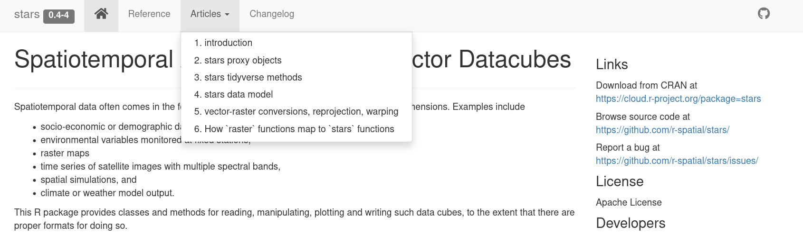
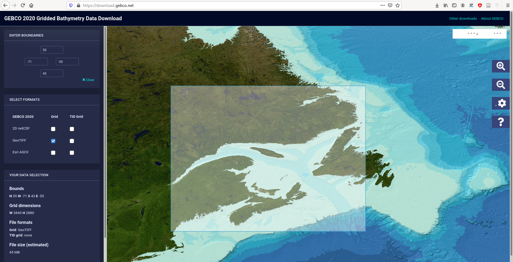
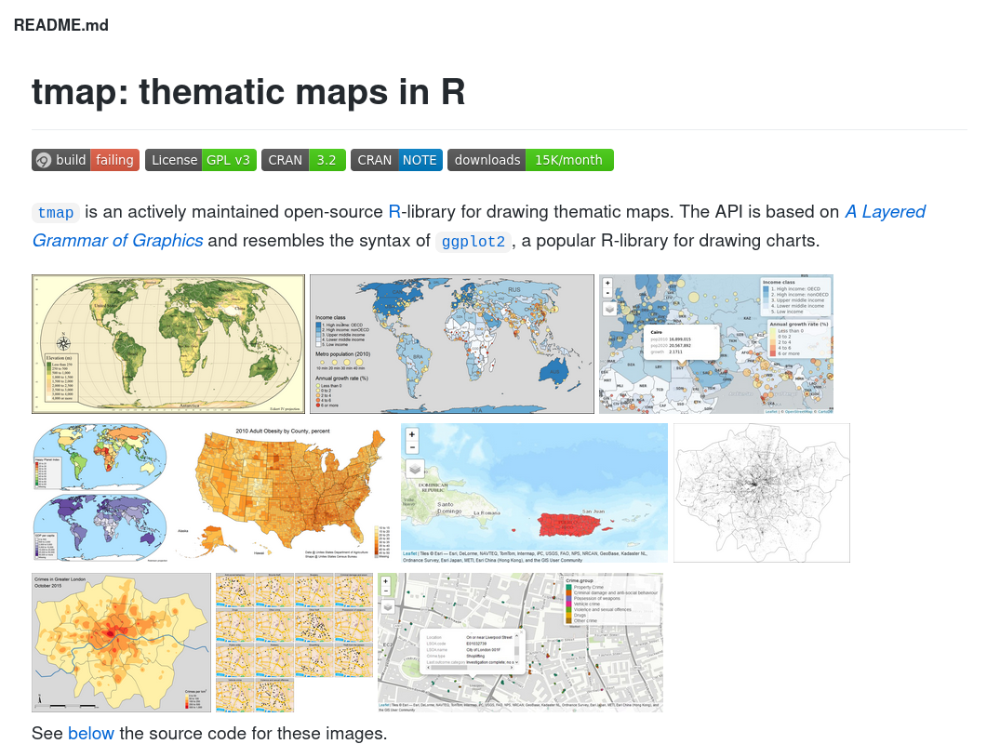

```{r setup, include = FALSE}
knitr::opts_chunk$set(
  comment = "#>",
  collapse = TRUE,
  warning = FALSE,
  message = FALSE,
  dev = "png",
  dpi = 108,
  fig.width = 5,
  fig.height = 4,
  fig.align = 'center',
  width = 120
)
# library(icon)
rfa <- function(...) icon::fontawesome(...)
library(raster)
rar <- raster("data/bathy.tif")  
class(rar)
library(stars)
ras <- read_stars("data/bathy.tif")  
class(ras)
stl <- sf::st_read("data/st_laurence.geojson")  
```


class: title-slide, middle


## .font200[`r icon::fontawesome("r-project")`asters]

<br>

.instructors[
  .font180[Manipulate rasters with `r rfa("r-project")`]
  <br><br><br>
  .authors140[David Beauchesne & Kevin Cazelles]
  <br><br>
  `r format(Sys.time(), '%B %d, %Y')`
  <br>
  .font200[
  [`r icon::fontawesome("github")`](https://github.com/inSilecoInc)
  [`r icon::fontawesome("database")`](https://github.com/inSilecoInc/workshop_raster/raw/main/data_and_script.zip)
  [`r icon::fontawesome("file-pdf")`](https://github.com/inSilecoInc/workshop_raster/raw/main/raster_p1.pdf)
  ]
]

<br>
</img>


.instructors[Content under [`r rfa("creative-commons")` `r rfa("creative-commons-by")`](https://creativecommons.org/licenses/by/4.0/) unless otherwise specified]


---

class: inverse, center, middle

# Learning objectives


## .font160[`r rfa("map")`  + `r rfa("r-project")`]


---

# Learning objectives

<br>

### Learn how to visualize raster interactively with `r rfa("r-project")`

--

1. Understand the benefits of manipulating raster files with `r rfa("r-project")`

--

2. Learn how to read and write raster files with `r rfa("r-project")`

--

3. Learn how to manipulate rasters `r rfa("r-project")`

--

4. Learn how to visualize rasters with `r rfa("r-project")`


---

class: inverse, center, middle

# `r rfa("info-circle")` Rationalize


## Why use `r rfa("r-project")` for rasters? (~15min)


???

If after the workshop what follows makes sense and you feel it is kind of true, it would a success. 


---

# Raster files 

> Raster files are grids of equally sized (most often) cells (or pixels).

--

> Every cell has a value (or a missing values).

--

> Cells are georeferenced: coordinates + CRS 

--

> Commonly used to represent continuous phenomena (e.g. temperature, elevation) and images (airborne or satellite imagery).


---
# Raster files 

- Examples of raster file formats: 

  - **GeoTIFF** (see https://trac.osgeo.org/geotiff)
  - **NetCDF** (see https://www.unidata.ucar.edu/software/netcdf/)
  - **KML** (also supports vector objects, see https://www.ogc.org/standards/kml/)
  - **GeoPackage** (also supports vector objects, see https://www.ogc.org/standards/geopackage)
  
--

- `r icon::fontawesome("info-circle")` More details :

  - https://gisgeography.com/gis-formats/
  - https://gdal.org/drivers/raster/index.html


---
# About `r rfa("r-project")`

> R is a programming language and free software environment for statistical computing and graphics supported by the R Foundation for Statistical Computing. &nbsp;&nbsp; [Wikipedia](https://bit.ly/2WFv1Nu)

--

.center[]


---
# Coding vs clicking

### 1. Programming/coding allows to automate what is frequently done!

--

### 2. Allow to make an analysis/a report reproducible 

--

  - create data pipeline 
  - for colleagues and future you

--

### 3. Increase efficiency (spend more time thinking)


--

### 4. Feeling empowered


???

One is not better than the other
do more, oik but do it in a better way


---
# Why `r rfa("r-project")`?

<br>

### 1. Freeware + Open source

--

### 2. **Package ecosystem** is rich and under active development  

--

### 3. Many packages connect `r rfa("r-project")` to other software/language

--

### 4. Community is wide, quite involved, responsive

--

### 5. You are most likely already using it! You are not starting from scratch

--

### **`r rfa("arrow-right")` Very little cannot be done with `r rfa("r-project")`**


???

Very few people look at the R source code but many people are now involved in package dev via GH or GL.

R Python Julia, whatever, language itself matters less that these
If you have time to learn a bit it might sometime makes sense, notably to work with other colleagues.

You don't start from scratch


---

class: inverse, center, middle

# `r rfa("pen")` Input/Ouput 


## Read and write raster files (30min)

???

Will introduce a bit more package to deal with raster in R


---
# `r rfa("r-project")` packages ecosystem for spatial objects

--

## Classes and Methods 

--

## Statistical Analyses

--

## Visualisation

--

## Data Retrieval 

---
# `r rfa("r-project")` packages ecosystem for spatial objects

## Classes and Methods 

--

### Vectors 

- [`sp`](https://CRAN.R-project.org/package=sp)
- [`sf`](https://CRAN.R-project.org/package=sf) `r rfa("check")`

--

### **Rasters** (our main focus)

- [`raster`](https://CRAN.R-project.org/package=raster) `r rfa("check")`
- [`stars`](https://CRAN.R-project.org/package=stars) `r rfa("check")`
- [`terra`](https://CRAN.R-project.org/package=terra) 

`r icon::fontawesome("info-circle")` https://keen-swartz-3146c4.netlify.app/raster.html#package-stars
`r icon::fontawesome("info-circle")` https://github.com/rspatial (15 packages)

???

Not visualisation later 


---
# Raster packages

### [`raster`](https://CRAN.R-project.org/package=raster) .font90[03/2010 (1.0.0) &nbsp; // &nbsp; 11/2020 (3.3-7)]
  
<br>

--
  
### [`terra`](https://CRAN.R-project.org/package=terra) .font90[03/2019 (0.5-2) &nbsp; // &nbsp; 11/2020 (0.9-11)]
  
> terra is an R package that replaces raster. It has a very similar interface, but it is simpler and much faster. 

<br>
--
  
### [`stars`](https://CRAN.R-project.org/package=stars) .font90[07/2018  (0.1-1) &nbsp; // &nbsp; 07/2020 (0.4-3)]
  
> Reading, manipulating, writing and plotting spatiotemporal arrays (raster and vector data cubes) in 'R'. 

Depends on [`sf`](https://CRAN.R-project.org/package=sf).
Note that `stars` and `sf` are [Tidyverse](https://www.tidyverse.org/) friendly.


---
# Package [`raster`](https://CRAN.R-project.org/package=raster)


### - Well documented 
  
  - see https://rspatial.org/raster/
  - many blog posts and tutorials (e.g. https://datacarpentry.org/r-raster-vector-geospatial/01-raster-structure/)

<!-- length(devtools::revdep("raster", dependencies = c("Depends", "
   Imports"))) -->

--

### - 383 packages depend on or import `raster` 

--

### - Depends on `sp` but also works with `sf`.


---
# Package [`stars`](https://CRAN.R-project.org/package=stars): SpatioTemporal ARrayS

### Extent `sf` to Raster and Vector Datacubes

.center[[](https://r-spatial.github.io/stars/index.html)] 
.right[.font80[see https://r-spatial.github.io/stars/index.html]]


---
# Package [`stars`](https://CRAN.R-project.org/package=stars): SpatioTemporal ARrayS

### - Well documented too

.center[]
.right[.font80[see https://r-spatial.github.io/stars/index.html]]

--

### - 9 packages depend on [`stars`](https://CRAN.R-project.org/package=stars)

### - So far, less material available online.


---
# Read a raster file 


## .center[.font200[ `r rfa("file")` `r rfa("arrow-right")` `r rfa("r-project")`]]

<br>

--

### 1. Files you created 

--

### 2. Files you found on the Internet 

--

### 3. `r rfa("r-project")` packages to download raster files


---
# Example file 



- https://download.gebco.net/ 
- `r icon::fontawesome("link")` [ata_and_script.zip](https://github.com/inSilecoInc/workshop_raster/raw/main/data_and_script.zip)


---
# Read with [`raster`](https://CRAN.R-project.org/package=raster)


```{R read_raster}
library(raster)
rar <- raster("data/bathy.tif")  
class(rar)
```


---
# Read with [`raster`](https://CRAN.R-project.org/package=raster)

```{R plot_raster}
plot(rar)
```


---
# Read with [`stars`](https://CRAN.R-project.org/package=stars)

```{R read_stars}
library(stars)
ras <- read_stars("data/bathy.tif")   # argument `driver` to specify the driver
class(ras)
```

---
# Read with [`stars`](https://CRAN.R-project.org/package=stars)

```{R plot_stars, cache = TRUE}
plot(ras)
```

---

# So ...

<br>

## - GeoTIFF `r icon::fontawesome("check")`

--

## - Other formats, how do we know?


---
# Check read/write capabilities with [`raster`](https://CRAN.R-project.org/package=raster)


`r icon::fontawesome("exclamation-circle")`  [`rgdal`](https://CRAN.R-project.org/package=rgdal) is required

```{R raster_drivers}
ra_dr <- rgdal::gdalDrivers()
head(ra_dr)
```

--

```{R raster_drivers2}
ra_dr[which(ra_dr$name == "GTiff"), ]
```

---
# Check read/write capabilities with [`stars`](https://CRAN.R-project.org/package=stars)

`r icon::fontawesome("exclamation-circle")` [`sf`](https://CRAN.R-project.org/package=rgdal) is required


```{R stars_drivers}
st_dr <- sf::st_drivers(what = "raster")
head(st_dr)
```

<!-- (-73/-41 62/37) see `data` -->

---
# Check read/write capabilities with [`stars`](https://CRAN.R-project.org/package=stars)


```{R stars_drivers2}
st_dr[which(st_dr$name == "GTiff"), ]
```

--
.right[

.font80[`r icon::fontawesome("info-circle")` https://gdal.org/drivers/raster/index.html]

.font80[`r icon::fontawesome("info-circle")` https://keen-swartz-3146c4.netlify.app/intro.html#reading]

]


---
# Write raster files

##  .center[.font200[`r rfa("r-project")` `r rfa("arrow-right")` `r rfa("file")`]]

--

## - Share the output file

--

## - Use another software (e.g. QGIS)

--

<br>

### `r icon::fontawesome("exclamation-circle")` Create an `output` directory

```{R create_dir}
dir.create("output", showWarnings = FALSE)
```


---
# Write with [`raster`](https://CRAN.R-project.org/package=raster)

```{R write_raster0}
ra_dr$name[ra_dr$create]
```

---
# Write with [`raster`](https://CRAN.R-project.org/package=raster)

```{R write_raster1, cache = TRUE}
writeRaster(rar, filename = "output/rar.gpkg", format = "GPKG", overwrite = TRUE)
```


---
# Write with [`stars`](https://CRAN.R-project.org/package=stars)

```{R write_stars0}
sort(st_dr$name[st_dr$write])
```

---
# Write with [`stars`](https://CRAN.R-project.org/package=stars)

```{R write_stars1, cache = TRUE}
write_stars(ras, dsn = "output/ras.gpkg", driver = "GPKG")
```

`r rfa("pencil-alt")` dsn stands for **data source name**.


---
# `r icon::fontawesome("flag-checkered")` Recap 

<br><br>

| Action            | *raster*                 | *stars*               |
|:------------------|:-------------------------|:----------------------|
| list drivers      | `rgdal::gdalDrivers()`   | `sf::st_drivers()`    |
| read files        | `raster()`               | `read_stars()`        |
| write files       | `rasterWrite()`          | `read_stars()`        |


---
# `r rfa("terminal")` R as a raster file converter 

```{r, echo = FALSE}
countdown::countdown(minutes = 10, seconds = 0)
```
<br>

--

### `r rfa("star")` Convert `bathy.tif` into `bathy.grd` (https://gdal.org/drivers/raster/rraster.html#raster-rraster)

--

### `r rfa("star")` `r rfa("star")` Create a function `conv_raster()` that handles any conversion supported.

--

### `r rfa("star")` `r rfa("star")` `r rfa("star")` Create a function that converts a object of class `RasterLayer` object to a `stars` one (and conversely)


<br>


---
# Solution `r rfa("star")`

### Convert `bathy.tif` into `bathy.grd` 

```{R sol1aa, cache = TRUE, include = TRUE}
# raster 
rr <- raster("data/bathy.tif")
writeRaster(rr, filename = "output/rar.grd", overwrite = TRUE)
```

--

```{R sol1ab, cache = TRUE, include = TRUE}
# stars 
rs <- read_stars("data/bathy.tif")
write_stars(rs, dsn = "output/ras.grd", driver = "rraster")
```

---
# Solution `r rfa("star")` `r rfa("star")`

### Create a function `conv_raster()` that handles any conversion supported.

```{R sol1ba, cache = TRUE, include = TRUE}
# raster 
conv_raster_r <- function(input, output, ...) {
  rr <- raster(input)
  writeRaster(rr, filename = output, ...)
}
conv_raster_r("data/bathy.tif", "output/rar2.grd", overwrite = TRUE)
```

--

```{R sol1bb, cache = TRUE, include = TRUE}
# stars
conv_raster_s <- function(from, to, ...) {
  rs <- read_stars("data/bathy.tif")
  write_stars(rs, dsn = "output/ras.grd",...)
}
conv_raster_s("data/bathy.tif", "output/ras2.grd", driver = "rraster")
```

---
# Solution `r rfa("star")` `r rfa("star")` `r rfa("star")`

### Create a function that converts a object of class `RasterLayer` object to a `stars` one (and conversely)


```{R sol1c, cache = TRUE, include = TRUE}
conv_raster_stars <- function(x) {
  if (class(x) == "RasterLayer") {
    tmp <- tempfile(fileext = ".tif")
    writeRaster(x, tmp)
    read_stars(tmp)
  } else if (class(x) == "stars") {
    tmp <- tempfile(fileext = ".tif")
    write_stars(x, tmp)
    raster(tmp)
  } else {
    warning("x should be of class `stars` or `RasterLayer`")
    NULL
  }
}
ras_n <- conv_raster_stars(rar)
rar_n <- conv_raster_stars(ras)
# conv_raster_stars(1)
```


---

class: inverse, center, middle

# `r rfa("cogs")` Manipulate 


## Do whatever you need with raster files (~1h15)


---
# Common operations

##  .center[.font200[`r rfa("file")` `r rfa("arrow-right")` `r rfa("r-project")` `r rfa("arrow-right")` `r rfa("file")`]]


---
# Common operations

##  .center[.font200[`r rfa("file")` `r rfa("arrow-right")` `r rfa("r-project")` `r rfa("arrow-right")` `r rfa("cogs")` `r rfa("arrow-right")` `r rfa("file")`]]

--

- change projection 
- basic calculations (e.g. average per regions, min/max)
- crop/mask 
- extraction
- resample 
- etc.

---
# What do we have? [`raster`](https://CRAN.R-project.org/package=raster)

```{R raster_obj}
class(rar)
rar
```

---
# What do we have? [`raster`](https://CRAN.R-project.org/package=raster)

```{R raster_obj_val}
values(rar)
```


---
# What do we have? [`raster`](https://CRAN.R-project.org/package=raster)

```{R raster_obj_fun}
dim(rar)
ncell(rar)
projection(rar)
bbox(rar)
extent(rar)
```

---
# What do we have? [`stars`](https://CRAN.R-project.org/package=stars)

```{R stars_obj}
class(ras)
ras
```

---
# What do we have? [`stars`](https://CRAN.R-project.org/package=stars)

```{R stars_val}
class(ras[[1]])
ras[[1]]
```

---
# What do we have? [`stars`](https://CRAN.R-project.org/package=stars)

```{R stars_obj_fun1}
dim(ras)
ncell(ras)
st_bbox(ras)
```

---
# What do we have? [`stars`](https://CRAN.R-project.org/package=stars)

```{R stars_obj_fun2}
ras_crs <- st_crs(ras)
class(ras_crs)
ras_crs
```

---
# What do we have? [`stars`](https://CRAN.R-project.org/package=stars)

```{R stars_obj_fun3}
ras_crs$input
ras_crs$proj4string
ras_crs$epsg
```
--

- https://epsg.io/
- https://epsg.io/4326


---
# Conversion between [`stars`](https://CRAN.R-project.org/package=stars) and [`raster`](https://CRAN.R-project.org/package=raster)


### Use a temporary file (see above)

--

```{R convert1}
rar_c <- st_as_stars(rar) 
class(rar_c)
```
--

```{R convert2}
ras_c <- as(ras, "Raster") 
class(ras_c)
```


---
# Basic computations with [`raster`](https://CRAN.R-project.org/package=raster)

```{R bc_rar1}
class(rar[,])
rar[1, 1]
rar[1:10, 11:20]
mean(rar[,]) # or mean(as.matrix(rar))
quantile(rar[,])
```

---
# Basic computations with [`raster`](https://CRAN.R-project.org/package=raster)

```{R bc_rar1_2}
rar2 <- rar # create a copy 
rar2[rar > 0] <- NA  # filter
plot(rar2)
```


---
# Basic cell-based computations with [`stars`](https://CRAN.R-project.org/package=stars)

```{R bc_ras1}
# extract value
class(ras[[1]])
ras[[1]][1, 1]
ras[[1]][1:10, 11:20]
```

---
# Basic cell-based computations with [`stars`](https://CRAN.R-project.org/package=stars)

```{R bc_ras1_2}
mean(ras[[1]]) 
quantile(ras[[1]])
```

---
# Basic cell-based computations with [`stars`](https://CRAN.R-project.org/package=stars)
  
```{R bc_rar1_3}
ras2 <- ras # create a copy
ras2[[1]][ras[[1]] < units::as_units(0, "m")] <- NA # filter
plot(ras2)
```


---
# `r rfa("terminal")` Mean along latitude and longitude 

```{r, echo = FALSE}
countdown::countdown(minutes = 15, seconds = 0)
```

### `r rfa("star")` Compute the mean elevation/depth along the latitude or/and longitude (optional: use elevation/depth filter)

--

### `r rfa("star")` `r rfa("star")` Create a function `mean_long_lat()` that computes mean elevation/depth along longitude and latitude (`r rfa("star")` `r rfa("star")` `r rfa("star")` include an argument to set an elevation/depth filter).

<br>


---
# Solution `r rfa("star")` 

### Compute the mean elevation/depth along the latitude or/and longitude (optional: use elevation/depth filter)

```{R sol2aa, include = TRUE}
flt <- 0
# raster 
rr <- rar 
rr[rr < flt] <- NA
mean(values(rr), na.rm = TRUE)
```

--

```{R sol2ab, include = TRUE}
flt <- 0
# raster 
rs <- ras
rs[[1]][rs[[1]] < units::as_units(flt, "m")] <- NA # filter
mean(rs[[1]], na.rm = TRUE)
```

---
# Solution `r rfa("star")` `r rfa("star")`  / `r rfa("star")` `r rfa("star")` `r rfa("star")` 

### Create a function `mean_long_lat()` that computes mean elevation/depth along longitude and latitude (include an argument to set an elevation/depth filter).


```{R sol2ba1, cache = TRUE, include = TRUE}
# raster
mean_long_lat_r <- function(x, gt_na = NULL, lt_na = NULL) {
  m <- as.matrix(x)
  if (!is.null(lt_na)) m[m < lt_na] <- NA
  if (!is.null(gt_na)) m[m > gt_na] <- NA 
  list(
    m_lon = apply(m, 1, mean, na.rm = TRUE),
    m_lat = apply(m, 2, mean, na.rm = TRUE)
  )
} 
```

---
# Solution `r rfa("star")` `r rfa("star")`  / `r rfa("star")` `r rfa("star")` `r rfa("star")` 


```{R sol2ba2, cache = TRUE, fig.width = 7, include = TRUE}
res1 <- mean_long_lat_r(rar)
par(mfrow = c(1, 2))
plot(res1$m_lon, main = "Along latitude", ylab = "elevation", xlab = "lat_index")
plot(res1$m_lat, main = "Along longitude", ylab = "elevation", xlab = "lon_index")    
```

---
# Solution `r rfa("star")` `r rfa("star")`  / `r rfa("star")` `r rfa("star")` `r rfa("star")` 


```{R sol2ba3, cache = TRUE, fig.width = 7, include = TRUE}
res2 <- mean_long_lat_r(rar, gt_na = 0)
par(mfrow = c(1, 2))
plot(res2$m_lon, main = "Along latitude", ylab = "elevation", xlab = "lat_index")
plot(res2$m_lat, main = "Along longitude", ylab = "elevation", xlab = "lon_index")
```

---
# Solution `r rfa("star")` `r rfa("star")`  / `r rfa("star")` `r rfa("star")` `r rfa("star")` 


```{R sol2bb1, include = TRUE}
# stars
mean_long_lat_s <- function(x, gt_na = NULL, lt_na = NULL) {
  m <- units::drop_units(ras[[1]])
  if (!is.null(lt_na)) m[m < lt_na] <- NA
  if (!is.null(gt_na)) m[m > gt_na] <- NA 
  list(
    m_lon = apply(m, 1, mean, na.rm = TRUE),
    m_lat = apply(m, 2, mean, na.rm = TRUE)
  )
} 
```

---
# Solution `r rfa("star")` `r rfa("star")`  / `r rfa("star")` `r rfa("star")` `r rfa("star")` 


```{R sol2bb2, cache = TRUE, fig.width = 7, include = TRUE}
res1 <- mean_long_lat_s(ras)
par(mfrow = c(1, 2))
plot(res1$m_lon, main = "Along latitude", ylab = "elevation", xlab = "lat_index")
plot(res1$m_lat, main = "Along longitude", ylab = "elevation", xlab = "lon_index")    
```

---
# Solution `r rfa("star")` `r rfa("star")`  / `r rfa("star")` `r rfa("star")` `r rfa("star")` 


```{R sol2bb3, cache = TRUE, fig.width = 7, include = TRUE}
res2 <- mean_long_lat_s(ras, gt_na = 0)
par(mfrow = c(1, 2))
plot(res1$m_lon, main = "Along latitude", ylab = "elevation", xlab = "lat_index")
plot(res1$m_lat, main = "Along longitude", ylab = "elevation", xlab = "lon_index")    
```


---
# Change map projection

- Reminder 

  - [`r icon::fontawesome("wikipedia-w")` List of map projections](https://en.wikipedia.org/wiki/List_of_map_projections)

--

  - [Interactive examples](https://mathigon.org/course/circles/spheres-cones-cylinders#sphere-maps)

--

- Let's use the spherical Mercator 
  - https://epsg.io/
  - https://epsg.io/3857


---
# Change map projection with [`raster`](https://CRAN.R-project.org/package=raster)

- `raster` uses [Proj](https://proj.org/) strings 
- https://epsg.io/3857

--

```{R rar_new_crs}
rar_crs <- CRS("+proj=merc +a=6378137 +b=6378137 +lat_ts=0.0 +lon_0=0.0 +x_0=0.0 +y_0=0 +k=1.0 +units=m +nadgrids=@null +wktext  +no_defs")
```


---
# Change map projection with [`raster`](https://CRAN.R-project.org/package=raster)

```{R projrar, cache = TRUE}
rar_t <- projectRaster(rar, crs = rar_crs)
projection(rar_t)
plot(rar)
```


---
# Change map projection with [`stars`](https://CRAN.R-project.org/package=stars)

```{R projrar2, cache = TRUE}
ras_t <- st_transform(ras, crs = 3857)
st_crs(ras_t)
```


---
# Crop 

```{R crop0}
plot(rar)
rect(-65, 45, -60, 50)
```

---
# Crop with [`raster`](https://CRAN.R-project.org/package=raster)

```{R crop_rar, cache = TRUE}
rar_c <- crop(rar, extent(-65, -60, 45, 50))
plot(rar_c)
```

---
# Crop with [`stars`](https://CRAN.R-project.org/package=raster)

```{R crop_ras, cache = TRUE}
ext <- st_bbox(c(xmin = -65, xmax = -60, ymin = 45, ymax = 50), crs = 4326)
ras_c <- st_crop(ras, ext)
plot(ras_c)
```


---
# Mask 

Let's use a shapefile of the Gulf of the St-Lawrence 

`r icon::fontawesome("link")` https://www.marineregions.org/gazetteer.php?p=details&id=4290

```{R stl} 
(stl <- sf::st_read("data/st_laurence.geojson"))
```

---
# Mask 

Values outside of a given geometry set to `NA`

```{R plot_stl, cache = TRUE} 
plot(sf::st_geometry(stl))
```


---
# Mask with [`raster`](https://CRAN.R-project.org/package=raster)

```{R rar_m, cache = TRUE} 
rar_m <- mask(rar, stl)
plot(rar_m)
```

---
# Mask with [`raster`](https://CRAN.R-project.org/package=raster)


```{R rar_m2, cache = TRUE}
rar_mi <- mask(rar, stl, inverse = TRUE)
plot(rar_mi)
```

---
# Mask with [`stars`](https://CRAN.R-project.org/package=stars)

```{R ras_m, cache = TRUE} 
ras_m <- ras[stl]
plot(ras_m)
```

---
# Mask with [`stars`](https://CRAN.R-project.org/package=stars)

```{R ras_m1, cache = TRUE} 
stl_i <- sf::st_difference(sf::st_as_sfc(st_bbox(ras)), stl)
plot(stl_i, col = 2)
```


---
# Mask with [`stars`](https://CRAN.R-project.org/package=stars)

```{R ras_m2, cache = TRUE} 
ras_mi <- ras[stl_i]
plot(ras_mi)
```


---
# `r icon::fontawesome("terminal")` Mean depth of the St-Lawrence

- `r rfa("star")` Compute the mean depth of the St-Lawrence (Gulf and river)

- `r icon::fontawesome("star")` `r icon::fontawesome("star")` Compare the depth of the Gulf of the St-Lawrence and the depth of the St-Lawrence river (various solutions!)


```{r, echo = FALSE}
countdown::countdown(minutes = 10, seconds = 0)
```

---
# Solution `r rfa("star")`

```{R sol3aa, cache = TRUE, include = TRUE}
# raster 
rar_m <- mask(rar, stl)
mean(ras_m[[1]], na.rm = TRUE)
```

```{R sol3ab, cache = TRUE, include = TRUE}
# stars 
ras_m <- ras[stl]
mean(ras_m[[1]], na.rm = TRUE)
```


---
# Solution `r rfa("star")` `r rfa("star")`

--

```{R sol3b0, cache = TRUE, include = TRUE}
plot(rar)
rect(-71, 43, -65.1, 55, border = 2, lwd = 4) 
rect(-64.9, 43, -55, 55, lwd = 4) 
```

???

You can find other shapefile

---
# Solution `r rfa("star")` `r rfa("star")`

```{R sol3b1, cache = TRUE, include = TRUE}
# raster 
rar_m <- mask(rar, stl)
rar_river <- crop(rar_m, extent(-71, -65, 43, 55))
rar_gulf <- crop(rar_m, extent(-65, -55, 43, 55))
mean(values(rar_river), na.rm = TRUE)
mean(values(rar_gulf), na.rm = TRUE)
```

---
# Solution `r rfa("star")` `r rfa("star")`

```{R sol3b1b, cache = TRUE, fig.width = 7.5, echo = -1, include = TRUE}
par(mfrow = c(1, 2), oma = c(0, 2, 0, 3))
plot(rar_river)
plot(rar_gulf)
```

---
# Solution `r rfa("star")` `r rfa("star")`

```{R sol3b1c, cache = TRUE, include = TRUE}
mean(values(rar_river), na.rm = TRUE)
mean(values(rar_gulf), na.rm = TRUE)
```


---
# Solution `r rfa("star")` `r rfa("star")`

```{R sol3b2, cache = TRUE, include = TRUE}
# stars 
ras_m <- ras[stl]
ras_river <- st_crop(ras_m, 
    st_bbox(c(xmin = -71, xmax = -65, ymin = 43, ymax = 55), crs = 4326)
)
ras_gulf <- st_crop(ras_m, 
  st_bbox(c(xmin = -65, xmax = -55, ymin = 43, ymax = 55), crs = 4326)
)
mean(ras_river[[1]], na.rm = TRUE)
mean(ras_gulf[[1]], na.rm = TRUE)
```


---
# Warping/Resampling

### Work with rasters of different resolution 

---
# Warping/Resampling with [`raster`](https://CRAN.R-project.org/package=raster)

```{R rar_warp, cache = TRUE}
# create a raster with the given resolution
mr <- matrix(runif(21*21), 21, 21)
rar_template1 <- raster(mr, xmn = -71, xmx = -55, ymn = 43, ymx = 55, 
    crs = projection(rar)) # create template
plot(rar_template1)
```

---
# Warping/Resampling with [`raster`](https://CRAN.R-project.org/package=raster)

```{R rar_warp2, cache = TRUE}
rar_w1 <- resample(rar, rar_template1)
plot(rar_w1)
```

---
# Warping/Resampling with [`raster`](https://CRAN.R-project.org/package=raster)

```{R rar_warp3, cache = TRUE}
rar_template2 <- raster(xmn = -71, xmx = -55, ymn = 43, ymx = 55, 
  crs = projection(rar), resolution = .25) # create template
plot(resample(rar, rar_template1))
```


---
# Warping/Resampling with [`raster`](https://CRAN.R-project.org/package=raster)

```{R ras_warp, cache = TRUE}
ras_template1 <- st_as_stars(st_bbox(ras), nx = 21, ny = 21, 
  values = runif(21 * 21)) # create template
ras_w1 <- st_warp(ras, ras_template1)
plot(ras_w1)
```

<!-- show how to do this with a second object -->

---
# Warping/Resampling with [`stars`](https://CRAN.R-project.org/package=stars)

```{R ras_warp2, cache = TRUE}
ras_w2 <- st_warp(ras, cellsize = 0.25, crs = st_crs(ras)) 
plot(st_warp(ras, ras_w2))
```


---
# Rasterize 

## Vectors `r icon::fontawesome("arrow-right")` Raster 

--

## Create a raster template 


---
# Rasterize with [`raster`](https://CRAN.R-project.org/package=raster)

```{R rasterr1, eval = FALSE}
# not run
stl_r <- rasterize(stl, rar)
plot(stl_r)
```


---
# Rasterize with [`stars`](https://CRAN.R-project.org/package=stars)

```{R rasters1, cache = TRUE}
stl_s <- st_rasterize(stl, dy = .1, dx = .1)
plot(stl_s)
```


---
# Stack 

### - Collection of rasters 

### - Same extent/resolution

### - Multi-band rasters (satellite images)

### - Handle several rasters at once 


---
# Stack with [`raster`](https://CRAN.R-project.org/package=raster)


### 2 classes : `RasterBrick` and `RasterStack`

--

> The main difference is that a RasterStack is loose collection of RasterLayer objects that can refer to different files (but must all have the same extent and resolution), whereas a RasterBrick can only point to a single file. 

.right[.font80[ `r icon::fontawesome("info-circle")` https://rspatial.org/raster/spatial/4-rasterdata.html#rasterstack-and-rasterbrick]]

--

### We'll focus on `RasterStack`


---
# Stack with [`raster`](https://CRAN.R-project.org/package=raster)

```{R rar_stc, cache = TRUE}
rar_stc <- stack(list(bath_v1 = rar, bath_v2 = rar * 2)) # could be a file path
class(rar_stc) 
nlayers(rar_stc)
```

--

```{R rar_stc1b, cache = TRUE}
class(rar_stc[[1]]) 
class(rar_stc[[2]]) 
```

---
# Stack with [`raster`](https://CRAN.R-project.org/package=raster)

```{R rar_stc2, cache = TRUE}
plot(rar_stc)
```

---
# Stack with [`raster`](https://CRAN.R-project.org/package=raster)

```{R rar_stc3, cache = TRUE}
plot(crop(rar_stc, extent(-65, -60, 45, 50)))
```


---
# Stack with [`raster`](https://CRAN.R-project.org/package=raster)

```{R rar_stc4, cache = TRUE}
rar_sum <- calc(rar_stc, fun = sum)
rar_sum
```

---
# Stack with [`raster`](https://CRAN.R-project.org/package=raster)


```{R rar_stc5, cache = TRUE}
plot(rar_sum) 
```


---
# Stack with [`stars`](https://CRAN.R-project.org/package=stars)

```{R ras_stc0}
ras
```

---
# Stack with [`stars`](https://CRAN.R-project.org/package=stars)

```{R ras_stc1}
ras_stc1 <- c(ras, ras * 2)
names(ras_stc1) <- c("bath_v1", "bath_v2")
ras_stc1
```

---
# Stack with [`stars`](https://CRAN.R-project.org/package=stars)

```{R ras_stc1b}
plot(ras_stc1)
```

---
# Stack with [`stars`](https://CRAN.R-project.org/package=stars)


```{R ras_stc2}
ras_stc1[1] # or ras_stc1["bath_v1"]
```

---
# Stack with [`stars`](https://CRAN.R-project.org/package=stars)


```{R ras_stc2b}
ras_stc1[2] # or ras_stc1["bath_v2"]
```


---
# Stack with [`stars`](https://CRAN.R-project.org/package=stars)

```{R ras_stc2c}
library(dplyr)
ras_stc1 %>% select("bath_v1")
```

---
# Stack with [`stars`](https://CRAN.R-project.org/package=stars)

```{R ras_stc2d}
ras_stc1 %>% mutate(bath_v3 = bath_v2 * 2)
```

---
# Stack with [`stars`](https://CRAN.R-project.org/package=stars)

```{R ras_stc3, cache = TRUE}
ras_stc2 <- c(ras, ras*2, along = "z")
ras_stc2
```

---
# Stack with [`stars`](https://CRAN.R-project.org/package=stars)

```{R ras_stc4, cache = TRUE}
plot(ras_stc2)
```

---
# Stack with [`stars`](https://CRAN.R-project.org/package=stars)

```{R ras_stc5, cache = TRUE}
ext <- st_bbox(c(xmin = -65, xmax = -60, ymin = 45, ymax = 50), crs = 4326)
plot(st_crop(ras_stc2, ext))
```


---
# Stack with [`stars`](https://CRAN.R-project.org/package=stars)

```{R ras_stc6, cache = TRUE}
(ras_ap <- st_apply(ras_stc2, c(1, 2), sum))
```

---
# Stack with [`stars`](https://CRAN.R-project.org/package=stars)

```{R ras_stc6b, cache = TRUE}
plot(ras_ap)
```


---
# `r icon::fontawesome("flag-checkered")` Recap 


| Action                    | `raster`               | `stars`                |
|:--------------------------|:-----------------------|:-----------------------|
| Get projection            | `projection()`         | `st_crs()`             |
| Get bounding box          | `bbox()`               | `st_bbox()`            |
| Change projection         | `projectRaster()`      | `st_transform()`       |
| Crop                      | `crop()`               | `st_crop()`            |
| Mask                      | `mask()`               | `[]<-`                 |
| Resample                  | `projectRaster()`      | `st_warp()`            |
| Rasterize                 | `rasterize()`          | `st_rasterize()`       |
| Stack                     | `stack()` or `brick()` | `c(along=...)`         |
| Apply functions on stacks | `calc()`               | `st_apply()`           |


`r icon::fontawesome("info-circle")` https://r-spatial.github.io/stars/articles/stars6.html


<!-- exo? -->


---

class: inverse, center, middle

# `r rfa("map")` Visualize


## Static visualization (~45min)


---
# `r rfa("r-project")` packages for raster visualization

--

### Static

- [`tmap`](https://CRAN.R-project.org/package=tmap) `r icon::fontawesome("check")`
- [`ggplot2`](https://CRAN.R-project.org/package=ggplot2) 
    - `r icon::fontawesome("info-circle")` https://r-spatial.github.io/stars/reference/geom_stars.html
    - `r icon::fontawesome("info-circle")` https://ggplot2.tidyverse.org/reference/geom_tile.html
- [`ggmap`](https://CRAN.R-project.org/package=ggmap)
    - `r icon::fontawesome("info-circle")` https://github.com/dkahle/ggmap
- [`rasterVis`](https://CRAN.R-project.org/package=rasterVis)
    - `r icon::fontawesome("info-circle")` https://oscarperpinan.github.io/rastervis/

--

### Interactive 

- [`tmap`](https://CRAN.R-project.org/package=tmap) 
- [`leaflet`](https://CRAN.R-project.org/package=leaflet)
- [`mapview`](https://CRAN.R-project.org/package=mapview)

`r icon::fontawesome("info-circle")` day 2 of the workshop.


---
# Using `plot()` and `image()` 

--

- `plot()` 
  - `r icon::fontawesome("arrow-right")` `?plot.stars`
  - `r icon::fontawesome("arrow-right")` `?raster::plot`

--

- `image()` 
  - `r icon::fontawesome("arrow-right")` `?image.stars`
  - `r icon::fontawesome("arrow-right")` `?raster::image`

--

- `par()` : margins, background color, ....


---
# Using `plot()` and `image()` 

```{R plot0, cache = TRUE}
plot(ras)
```


---
# Using `plot()` and `image()` 

```{R, pre_plot}
# breaks
bks <- c(seq(-5000, 0, 1000), 250, 500, 750, 1000)
# cols 
cls <- c("#c7cbce", "#687677", "#222d3d", "#25364a", "#172434", 
  "#ad6a11", "#e6a331", "#e4be29", "#f2ea8b")
```

---
# Using `plot()` and `image()` 

```{R, plot1}
par(las = 1, bg = "#f79c74", cex.axis = .7, mar = c(2, 2, 2, 4))
plot(ras,  breaks = bks, col = cls, main = "St-Lawrence map", axes = TRUE)
```

---
# Using `plot()` and `image()` 

```{R, plot1b}
par(las = 1, bg = "#f79c74", cex.axis = .7, mar = c(2, 2, 2, 4), oma = c(0, 2, 0 ,2))
plot(ras,  breaks = bks, col = cls, main = "St-Lawrence map", axes = TRUE)
```


---
# [`tmap`](https://CRAN.R-project.org/package=tmap)

.center[]

`r icon::fontawesome("info-circle")` https://github.com/mtennekes/tmap


---
# [`tmap`](https://CRAN.R-project.org/package=tmap)

```{R tmap0}
library(tmap)
map0 <- tm_shape(stl) + tm_borders(col = "red")
map0
```

---
# [`tmap`](https://CRAN.R-project.org/package=tmap)

```{R tmap1}
map1 <- map0 + tm_compass(type = "8star", position = c("left", "top")) 
map1 
```

---
# [`tmap`](https://CRAN.R-project.org/package=tmap)


- works with [`raster`](https://CRAN.R-project.org/package=raster) and [`stars`](https://CRAN.R-project.org/package=stars) (the latter is recommended)

--

- let's focus on `stars`

```R
# create a stars object from a raster object
st_as_stars(rar)
```

---
# [`tmap`](https://CRAN.R-project.org/package=tmap)

```{R tmap2, cache = TRUE}
names(ras)
map2 <- tm_shape(ras) + tm_raster("bathy.tif")
```


---
# [`tmap`](https://CRAN.R-project.org/package=tmap)

```{R tmap3, cache = TRUE}
map3 <- map2 + map1  # the order matters
map3
```


---
# [`tmap`](https://CRAN.R-project.org/package=tmap)

```{R tmap4, cache = TRUE}
map4 <- map2 + map1 + tm_style("bw")
map4
```

---
# [`tmap`](https://CRAN.R-project.org/package=tmap)

```{R tmap5, cache = TRUE}
map5 <- tm_shape(ras) + tm_raster("bathy.tif", breaks = c(seq(-5000,
    0, 1000), 250, 500, 750, 1000), palette = "viridis") 
map5 
```

---
# [`tmap`](https://CRAN.R-project.org/package=tmap)


- `r rfa("info-circle")` https://geocompr.robinlovelace.net/adv-map.html

- `r rfa("info-circle")` https://github.com/mtennekes/tmap

- `r rfa("info-circle")` https://www.rdocumentation.org/packages/tmap/versions/3.2/topics/tm_layout

---
# `r rfa("star")` `r rfa("star")` Reproduce this map

```{R tmap_exo, echo = FALSE, cache = TRUE, fig.width = 6, fig.height = 5}
# manipulation 
ras_v <- ras[stl]
names(ras_v) <- "Elevation"
# colors 
pal <- colorRampPalette(c("#c7cbce", "#687677", "#222d3d", "#25364a", "#172434", "#ad6a11", "#e6a331", "#e4be29", "#f2ea8b"))
# raster 
elv <- tm_shape(ras_v) + 
  tm_raster("Elevation", breaks = seq(-800, 200, 100), palette = pal(11), midpoint = NA) + 
  tm_layout(main.title = "St-Lawrence river & Gulf", main.title.color = "#ad6a11") + 
  tm_xlab("longitude", size = 0.5) + tm_ylab("latitude", size = 0.5) +
  tm_graticules(lwd = .5, col = "#aaaaaa")
  
shp <- tm_shape(stl) + tm_borders(col = "black", lwd = 2)
oth <- tm_compass(type = "8star", position = c("left", "bottom")) +     
  tm_scale_bar(breaks = c(0, 100, 200), text.size = .8) + 
  tm_logo(c("https://www.r-project.org/logo/Rlogo.png"), position = c("right", "top"), height = 3) 
elv + shp + oth
```

---
# Solution 

```{R, include = TRUE, eval = FALSE}
# manipulation 
ras_v <- ras[stl]
names(ras_v) <- "Elevation"
# colors 
pal <- colorRampPalette(c("#c7cbce", "#687677", "#222d3d", "#25364a", 
  "#172434", "#ad6a11", "#e6a331", "#e4be29", "#f2ea8b"))
# raster 
elv <- tm_shape(ras_v) + 
  tm_raster("Elevation", breaks = seq(-800, 200, 100), palette = pal(11), midpoint = NA) + 
  tm_layout(main.title = "St-Lawrence (River & Gulf)", main.title.color = "#ad6a11") + 
  tm_xlab("longitude", size = 0.5) + tm_ylab("latitude", size = 0.5) +
  tm_graticules(lwd = .5, col = "#aaaaaa")
```

---
# Solution 

```{R, include = TRUE, eval = FALSE}
# borders 
shp <- tm_shape(stl) + tm_borders(col = "black", lwd = 2)

# other elements 
oth <- tm_compass(type = "8star", position = c("left", "bottom")) +
    tm_scale_bar(breaks = c(0, 100, 200), text.size = .8) + 
    tm_logo("https://www.r-project.org/logo/Rlogo.png", position = c("right", "top"), height = 3) 
    
elv + shp + oth
```

---

# Resources `r rfa("link")`

- [Geocomputation with R](https://geocompr.robinlovelace.net/)
- [Spatial Data Science](https://keen-swartz-3146c4.netlify.app/)
- [Blog R-spatial](https://www.r-spatial.org/)
- [Open Geospatial Consortium](https://www.ogc.org/)
- https://nowosad.github.io/BioGIS_19/workshop/#64