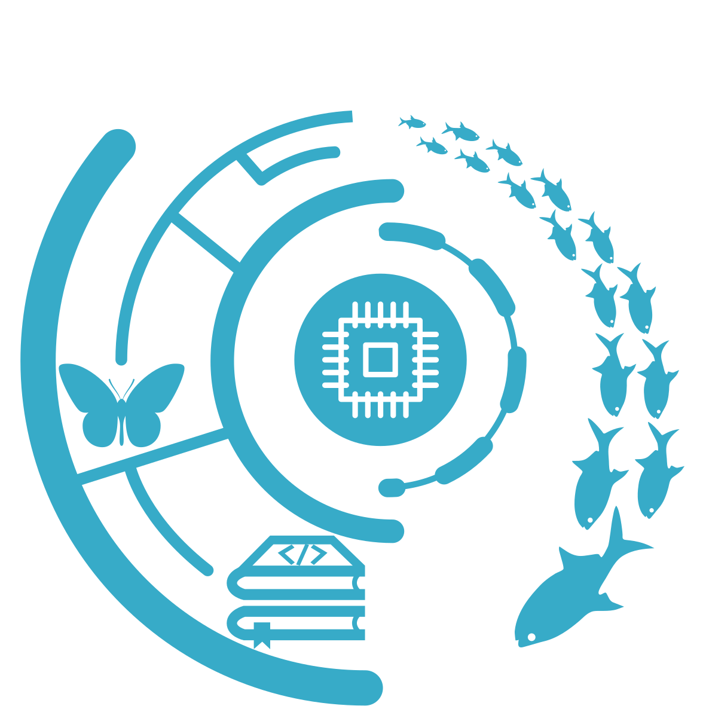

class: title-slide, middle


## .font200[`r icon::fontawesome("r-project")`asters]

<br><br>

.instructors[
  .font180[Manipulate raster files with `r icon::fontawesome("r-project")`]
  <br><br><br>
  .authors140[David Beauchesnes & Kevin Cazelles]
  <br><br>
  `r format(Sys.time(), '%B %d, %Y')`
]

<br><br><br><br><br><br>


</img>


```{r setup, include = FALSE}
knitr::opts_chunk$set(
  comment = "#>>",
  collapse = TRUE,
  warning = FALSE,
  message = FALSE,
  fig.width = 7,
  fig.height = 5.25,
  fig.align = 'center',
  width = 120
)
mypar <- list(fg = "#37abc8", bg = "transparent", las = 1)
library(icon)
```

---

class: inverse, center, middle

# Learning objectives


## .font160[`r icon::fontawesome("map")`  + `r icon::fontawesome("r-project")`]


---

# Learning objectives

<br>

1. Understand the benefits of manipulating raster files with `r icon::fontawesome("r-project")`

--

2. Learn how to read and write raster files with `r icon::fontawesome("r-project")`

--

3. Learn how to manipulate raster files `r icon::fontawesome("r-project")`

--

4. Learn how to m visualize raster with `r icon::fontawesome("r-project")`


---

class: inverse, center, middle

# `r icon::fontawesome("info-circle")` Rationalize


## Why use `r icon::fontawesome("r-project")` for rasters?


---

# Raster files 

> A raster files consists of a grid of equally sized cells (or pixels) that all have a values (or a missing value) for one single variable. 

--

> Cells are georeferenced: coordinates + CRS 

--

- commonly used to represent continuous phenomenon


---
# Raster files 

- Examples of raster file formats: 

  - `geotiff`
  - `ncdf`
  - `kml`
  


---
# `r icon::fontawesome("r-project")` Packages 


- [`raster`](https://CRAN.R-project.org/package=raster)
- [`stars`](https://CRAN.R-project.org/package=stars)
- [`terra`](https://CRAN.R-project.org/package=terra)


---

class: inverse, center, middle

# `r icon::fontawesome("pen")` Input/Ouput 


---
# Raster

```{R}
library(raster)
writeFormats()
```


---

class: inverse, center, middle

# `r icon::fontawesome("cogs")` Manipulate


---

class: inverse, center, middle

# `r icon::fontawesome("map")` Visualize


---
# Exercice + countdown

1. Do that 
2. Do that 
3. Do that 
4. Do that 
5. Do that 

```{r, include = FALSE}
countdown::countdown(minutes = 3, seconds = 0)
```


---

# Resources `r icon::fontawesome("link")`

- [Geocomputation with R](https://geocompr.robinlovelace.net/)
- [Blog R-spatial](https://www.r-spatial.org/)
- [Open Geospatial Consortium](https://www.ogc.org/)